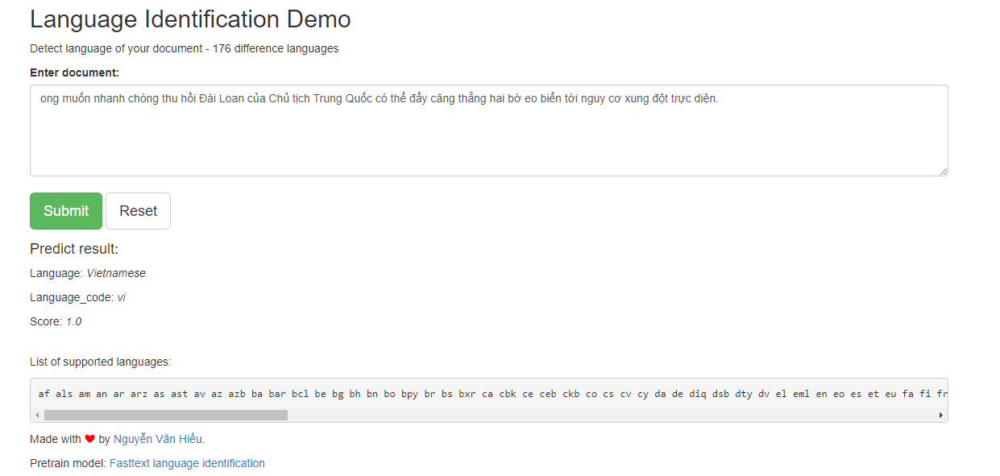

# Language Identification Demo

# How to run
- Install Python 3
- Run this command:
```text
pip install -r requirements.txt

python app.py
```
- Open [localhost:5000/check](localhost:5000/check) and see how it work

# Model

Pretrain model for language identifier can be found at: https://fasttext.cc/docs/en/language-identification.html

# Screenshots

